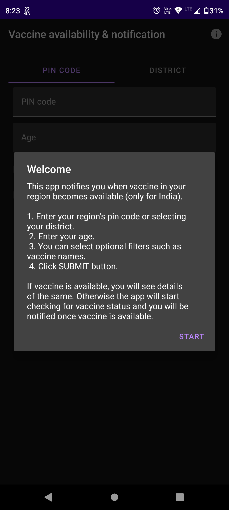
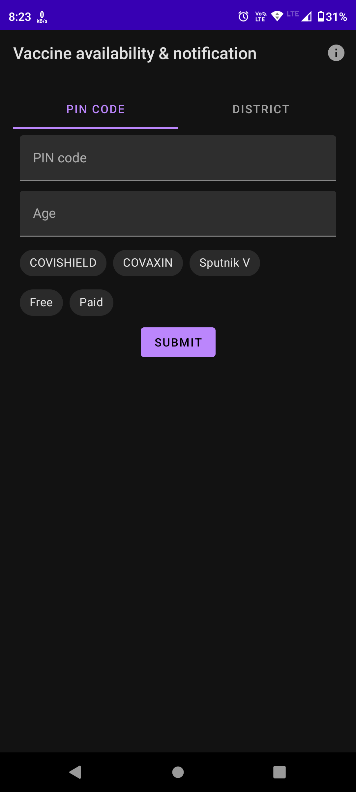
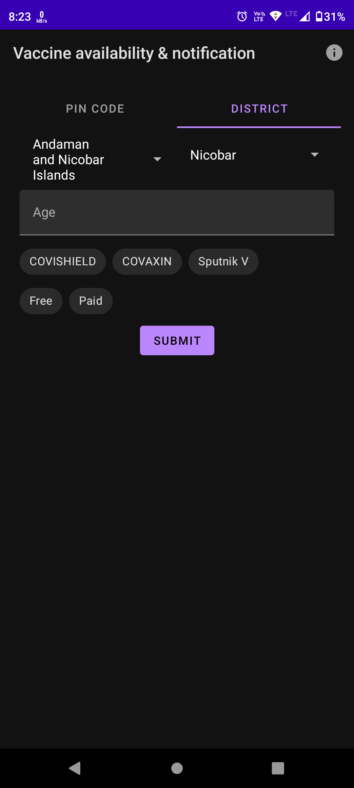
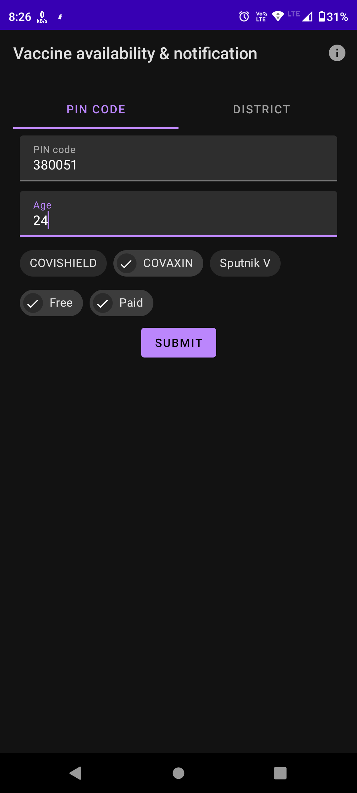
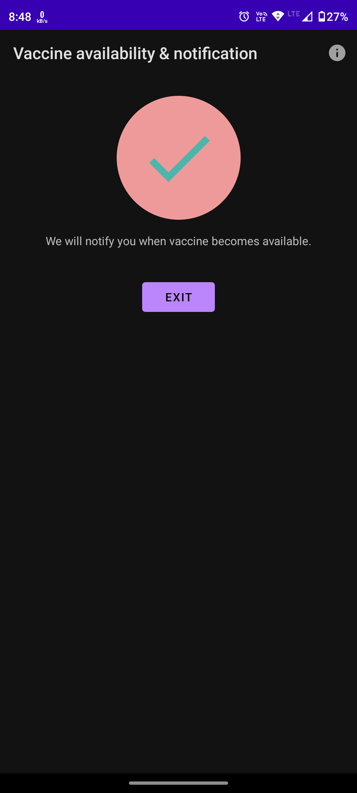
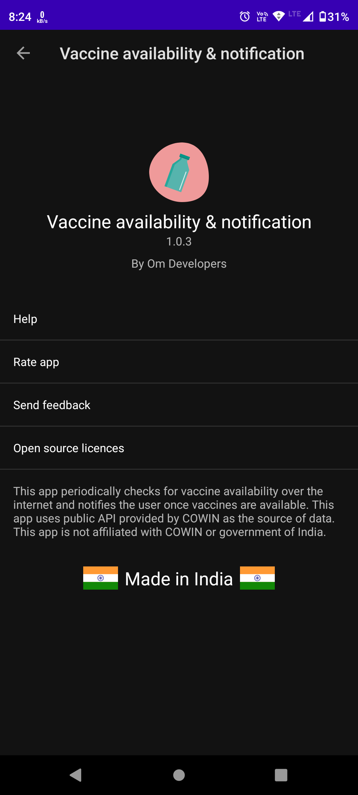
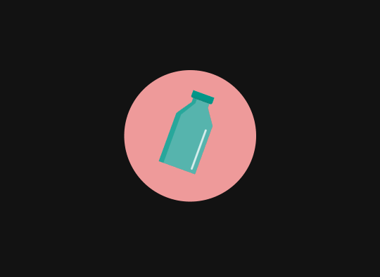

# VaccineAvailabilityNotification

**VaccineAvailabilityNotification** is an Android app designed to notify users about available vaccine slots in their area. I created this app at the time when vaccine availability was limited and people used to rush to get their slot booked. This app uses APIs provided by the Government of India at https://apisetu.gov.in/

## Features

- **Real-Time Notifications:** Get notified instantly when a vaccine slot becomes available in your selected location.
- **Location-Based Search:** Choose your location and monitor vaccine availability nearby.

## Tech Stack

- **Frontend:** XML, Android SDK
- **Backend:** APIs by https://apisetu.gov.in/

## Screenshots
  
  

  

